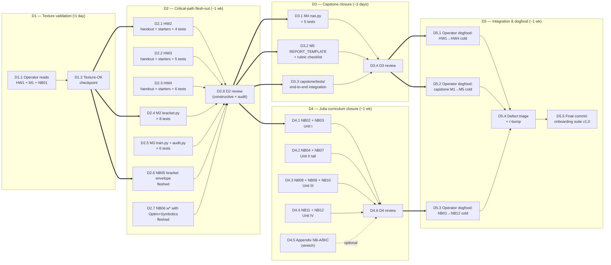

# `onboarding/DEVELOPMENT-PLAN.md` — building out the onboarding assets

> **Scope.** This is a *meta-plan*: how we get from the current state
> (one fleshed PSet, one fleshed capstone milestone, one fleshed
> Pluto notebook, plus scaffolds for the other ~20 artefacts) to a
> production-ready onboarding suite that a graduate student can pick
> up cold.
>
> **Audience.** The implementer (Claude or the operator); the
> reviewer (operator); future contributors who inherit the suite.
>
> **Discipline.** Per repo
> [`copilot-instructions.md`](../.github/copilot-instructions.md):
> *implement vigorously, concurrently; review constructively, audit
> adversarially; let no stone unturned; document progressively;
> commit at each gate, milestone, or feature.* This plan instantiates
> that mantra for the onboarding suite specifically.
>
> **Out of scope.** The Lean mechanisation track
> (`partition-sandwich-preprint/formal/`), Paper B / Paper C, any
> experiment re-runs. Those have their own plans.

---

## 1. Current state (inventory)

| Asset | State | Path |
|---|---|---|
| Operator on-ramp plan | **r4** (own-pedagogy canonical) | [PLAN.md](PLAN.md) |
| Graduate projects: top-level design | ✅ fleshed | [projects/README.md](projects/README.md) |
| PSets: index | ✅ fleshed | [projects/psets/README.md](projects/psets/README.md) |
| HW1 — Hbin & HR on a coin | ✅ **fully fleshed** (handout + 4 starters + 4 tests) | [projects/psets/hw1/](projects/psets/hw1) |
| HW2 — partitions, cond. entropy, toy 1-WL | 🟡 README stub only | [projects/psets/hw2/](projects/psets/hw2) |
| HW3 — T1 verifier on 3 cells | 🟡 README stub only | [projects/psets/hw3/](projects/psets/hw3) |
| HW4 — aggregator inflation on Cora | 🟡 README stub only | [projects/psets/hw4/](projects/psets/hw4) |
| Capstone — index | ✅ fleshed | [projects/capstone/README.md](projects/capstone/README.md) |
| M1 — data + partition harness | ✅ **fully fleshed** (partition.py + 6 tests) | [projects/capstone/milestone1/](projects/capstone/milestone1) |
| M2 — bracket computer | 🟡 README stub | [projects/capstone/milestone2/](projects/capstone/milestone2) |
| M3 — train + audit GCN | 🟡 README stub | [projects/capstone/milestone3/](projects/capstone/milestone3) |
| M4 — NAS pre-filter | 🟡 README stub | [projects/capstone/milestone4/](projects/capstone/milestone4) |
| M5 — calibrated report | 🟡 README stub | [projects/capstone/milestone5/](projects/capstone/milestone5) |
| Julia theory — design | ✅ fleshed | [julia-theory/README.md](julia-theory/README.md), [CURRICULUM.md](julia-theory/CURRICULUM.md), [Project.toml](julia-theory/Project.toml) |
| NB01 — binary entropy | ✅ **fully fleshed** (19 cells, Symbolics, falsify) | [julia-theory/notebooks/01_binary_entropy.jl](julia-theory/notebooks/01_binary_entropy.jl) |
| NB02–NB12 | 🟡 Pluto-format scaffolds with `# TODO(reader)` | [julia-theory/notebooks/](julia-theory/notebooks) |
| Appendix NB A/B/C | 🔴 not started | — |

✅ = production-ready, 🟡 = scaffolded, 🔴 = not started.

---

## 2. Phase model

Five phases, **D1–D5**. Each phase has:

- a goal (one sentence),
- an exit gate (objective, checkable),
- a constructive review (peer-style, "is this useful?"),
- an adversarial audit (red-team, "can I break this?"),
- a commit per task per the repo's conventional-commit template.

```
D1 — Texture validation       (cheap; gates everything else)
D2 — Critical-path flesh-out  (HW2–HW4, M2–M3, NB05+NB06)
D3 — Capstone closure         (M4, M5, integration tests)
D4 — Julia curriculum closure (NB04, NB07–NB12, appendices)
D5 — Integration & dogfood    (operator walks it cold; defects flow back)
```

D1 is small and fast (~½ day). D2–D4 are parallelisable across the
three tracks (PSets, capstone, Julia). D5 is the only phase that
*must* be operator-driven; everything before can be implementer-led.

---

## 3. PERT diagram



**Critical path.** `D1.1 → D1.2 → D2.4 → D2.5 → D2.8 → D3.1 → D3.4 → D5.2 → D5.4 → D5.5`.
(The capstone is the longest chain; PSets and Julia run in parallel.)

---

## 4. Work breakdown structure (WBS)

Each row is one unit of work, sized so it can be *one commit* per
the repo's
[`copilot-instructions.md`](../.github/copilot-instructions.md) §4.

### Phase D1 — Texture validation

| ID | Task | Owner | Effort | Output |
|---|---|---|---|---|
| D1.1 | Operator reads HW1 handout + M1 partition.py + NB01 cells; takes notes | Operator | 1 h | `notes/d1-texture-review.md` |
| D1.2 | Texture-OK checkpoint (decision: proceed / revise 01s first) | Operator | 15 min | flip-bit in this plan §6 |

**Exit gate (G-D1):** the operator signs off the three "shape" files
are *what they want at scale*. If any is rejected, that one file is
revised first; D2 does not start until G-D1 is green.

### Phase D2 — Critical-path flesh-out (parallelisable)

| ID | Task | Owner | Effort | Output |
|---|---|---|---|---|
| D2.1 | HW2 — partitions, cond. entropy, toy 1-WL: handout.md + 4 starter files + 4 tests | Implementer | 3 h | `psets/hw2/{handout.md,starter/*.py,tests/test_*.py}` |
| D2.2 | HW3 — T1 verifier from scratch on 3 cells: handout.md + 5 starters + 5 tests | Implementer | 4 h | `psets/hw3/...` |
| D2.3 | HW4 — aggregator inflation on Cora: handout.md + 5 starters + 6 tests | Implementer | 5 h | `psets/hw4/...` (depends on `torch_geometric`) |
| D2.4 | M2 `bracket.py` + 8 tests; mutate-fail-revert in writeup | Implementer | 4 h | `capstone/milestone2/{bracket.py,tests/}` |
| D2.5 | M3 `train.py` + `audit.py` + 6 tests; reaches ≥75% on Cora; scatter plot | Implementer | 5 h | `capstone/milestone3/...` |
| D2.6 | NB05 — bracket envelope: fleshed cells matching NB01 texture | Implementer | 2 h | `julia-theory/notebooks/05_bracket_envelope.jl` |
| D2.7 | NB06 — w* with Optim + Symbolics: fleshed; cross-check with Enzyme appendix-hook | Implementer | 2 h | `julia-theory/notebooks/06_uniform_slack.jl` |
| D2.8 | D2 constructive review + adversarial audit (see §5) | Operator + Implementer | 2 h | `notes/d2-review.md` + commit |

**Exit gate (G-D2):** all D2 deliverables exist; every PSet test
file is collected by `pytest --collect-only`; every NB opens in
Pluto without error; every starter file fails informatively before
being filled. Audit checklist (§5) passes ≥90%.

### Phase D3 — Capstone closure

| ID | Task | Owner | Effort | Output |
|---|---|---|---|---|
| D3.1 | M4 `nas.py` + 5 tests; reproduces τ ≥ 0.3 on a 6-arch menu | Implementer | 5 h | `capstone/milestone4/...` |
| D3.2 | M5 `REPORT_TEMPLATE.md` (10 sections, calibration table) + rubric checklist | Implementer | 3 h | `capstone/milestone5/REPORT_TEMPLATE.md` |
| D3.3 | `capstone/tests/test_end_to_end.py`: M1→M2→M3 wiring on a tiny synthetic graph | Implementer | 3 h | `capstone/tests/...` |
| D3.4 | D3 review | Operator + Implementer | 1 h | `notes/d3-review.md` + commit |

**Exit gate (G-D3):** end-to-end pytest green on synthetic; rubric
checklist sums to 100; REPORT_TEMPLATE is itself a passing example
(i.e. running the rubric on the template scores ≥80).

### Phase D4 — Julia curriculum closure

| ID | Task | Owner | Effort | Output |
|---|---|---|---|---|
| D4.1 | NB02 + NB03: Unit I tail (joint dist + Fano vs HR) | Implementer | 4 h | `notebooks/02*, 03*` |
| D4.2 | NB04 + NB07: Unit II tail (Bayes landscape + achievable region) | Implementer | 4 h | `notebooks/04*, 07*` |
| D4.3 | NB08 + NB09 + NB10: Unit III (refinement, witnesses, unimprovability) | Implementer | 6 h | `notebooks/08*, 09*, 10*` |
| D4.4 | NB11 + NB12: Unit IV (aggregators, robust constancy) | Implementer | 4 h | `notebooks/11*, 12*` |
| D4.5 | (Stretch) Appendix NB-A (matrix calculus, Edelman style), NB-B (differential entropy), NB-C (Lagrangian dual) | Implementer | 8 h | `notebooks/A*, B*, C*` |
| D4.6 | D4 review | Operator + Implementer | 2 h | `notes/d4-review.md` + commit |

**Exit gate (G-D4):** all 12 main notebooks fully reactive on a
fresh Julia install via `julia --project=. -e 'using Pkg; Pkg.instantiate()'`.
Each notebook's "what you should see" matches a peer's screenshot
to qualitative shape. Appendices are *optional*: G-D4 passes
without them.

### Phase D5 — Integration & dogfood

| ID | Task | Owner | Effort | Output |
|---|---|---|---|---|
| D5.1 | Operator dogfood: HW1 → HW4 on a fresh clone in one sitting | Operator | 1 day | `notes/d5-dogfood-psets.md` |
| D5.2 | Operator dogfood: capstone M1 → M5 over two evenings | Operator | 2 days | `notes/d5-dogfood-capstone.md` + the operator's actual capstone repo (private branch) |
| D5.3 | Operator dogfood: NB01 → NB12 in one sitting | Operator | 4 h | `notes/d5-dogfood-julia.md` |
| D5.4 | Defect triage: every "I had to guess" in dogfood notes becomes a TODO; classify into (must-fix | nice-to-fix | by-design) | Implementer | 1 day | `notes/d5-defects.md` + fix commits |
| D5.5 | Final commit: `onboarding: v1.0`; tag; announce | Implementer | 30 min | git tag |

**Exit gate (G-D5):** the operator's dogfood notes contain zero
"must-fix" defects. (Nice-to-fix and by-design are allowed; they
just open the backlog for v1.1.)

---

## 5. Review gates — formats

### 5.1 Constructive review (peer-style)

For each phase exit, the reviewer answers **5 questions** in writing
(`notes/d<N>-review.md`):

1. *Did this phase do what its §3 PERT promised?*
2. *Pick one task. If a graduate student followed only its outputs,
   would they learn the intended thing?*
3. *Which file in this phase is the most likely to confuse a
   first-timer? Suggest one concrete tightening.*
4. *Which file is the most likely to bore a strong student? Suggest
   one concrete deepening.*
5. *Was anything done that wasn't in the WBS?* (If yes — scope
   creep. Justify or revert per repo §implementationDiscipline.)

### 5.2 Adversarial audit (red-team)

For each phase exit, the auditor runs a **checklist of 8 items** and
records pass/fail (`notes/d<N>-audit.md`):

1. **TODO discipline** — every `# TODO(student)` / `# TODO(reader)`
   actually marks 5–20 LOC of load-bearing code, not a hint.
2. **Test honesty** — at least one mutation of any starter file
   causes at least one test to fail loudly (not silently pass).
3. **Reference value reachability** — every "expected" number in any
   handout or notebook is reproducible from a published artefact
   (cited inline).
4. **Calibration column** — every writeup has it; every claim has a
   HIGH/MEDIUM/LOW/UNVERIFIED tag.
5. **Cross-link integrity** — every relative link in every README /
   handout resolves (use `find . -name '*.md' -exec markdown-link-check`
   or eyeball).
6. **Forbidden patterns** absent — `\path{}` / `\url{}` in captions,
   `\Eqref{}`, single-commit "everything" pushes, brute-force retry
   loops in starters.
7. **Twin parity (only where applicable)** — if a starter cites a
   number from `main.tex`, the same citation works against `main.md`.
8. **Adversarial confidence** — the auditor states one claim from
   the phase output that they would label LOW; the implementer
   either defends with evidence or downgrades.

A phase passes audit if **≥7/8** are green. Below that, the phase
loops once before promotion to the next.

### 5.3 Commit policy

Per repo §4, each WBS row above commits *exactly once*, using the
template:

```
onboarding <phase>.<task>: <short summary>

<one-paragraph what>
<one-paragraph why / adversarial framing>
<bullets of mechanical changes>
```

Example for D2.1:

```
onboarding D2.1: flesh HW2 handout + starters + tests

Lift HW1 texture (handout.md + four-starter + four-test layout) to
the partition+cond-entropy material. The student writes
cond_entropy() and a one-WL refinement step; the tests check the
C_6 vs 2K_3 blind spot (1-WL fails to distinguish them).

Adversarial framing: HW2 is the first PSet that uses a graph.
Risk: students who skipped PLAN item V (toy 1-WL by hand) collapse
here. Mitigation: README links PLAN item V as a hard prerequisite.

- psets/hw2/handout.md (5 questions)
- psets/hw2/starter/{cond_entropy,wl_step,c6_vs_2k3,writeup_check}.py
- psets/hw2/tests/test_q{1,2,3,4}.py
```

No "everything" commits. No `--no-verify`.

---

## 6. Decision points (checkboxes the operator flips)

These are the load-bearing decisions. The plan is *not actionable
beyond D1* until each is resolved.

- [ ] **Texture of HW1.** Is the *handout depth* (5 questions, 60/25/15 rubric, mutate-fail-revert in Q4) the texture for HW2–HW4? If no: revise HW1 first, then propagate.
- [ ] **Texture of M1.** Is the *starter-density* (Partition dataclass with TODO invariant check, ~5–15 LOC per TODO) the texture for M2–M5? If no: revise M1 first.
- [ ] **Texture of NB01.** Is the *slider → numeric → symbolic → plot → falsify → reflect* rhythm the texture for NB02–NB12? If no: pick a different notebook (likely NB05 — the centrepiece) to revise, then propagate.
- [ ] **Appendix scope.** Are NB-A/B/C (matrix calculus, differential entropy, Lagrangian dual) in the v1.0 scope, or deferred to v1.1?
- [ ] **Julia dual track in HW3 + M2.** Is the Python-OR-Julia equal-first-class option *in v1.0*, or deferred? (Default: deferred; v1.0 stays Python-only on the graded paths to keep the rubric simple.)
- [ ] **CI for onboarding.** Should a `.github/workflows/onboarding.yml` run `pytest psets/hw*/tests/` and `pytest capstone/*/tests/` on every push to PRs touching `onboarding/`? (Default: yes; cheap; catches drift.)
- [ ] **Julia CI.** Should the same workflow run Julia notebook syntax-checks via `Pluto.try_load_notebook`? (Default: no for v1.0; the Julia env is big; defer to v1.1.)

---

## 7. Risk register

| ID | Risk | Likelihood | Impact | Mitigation |
|---|---|---|---|---|
| R1 | HW4 / M3 require `torch_geometric` which can be painful to install on macOS Apple Silicon | Medium | High (blocks a chunk of D2) | Provide a `pip install -r requirements.txt` recipe pinned to a known-good combo; document the metal-fallback path |
| R2 | Cora is downloaded on first PyG call; firewalled environments will hang | Low | Medium | Document the manual download fallback in HW4 / M1 READMEs |
| R3 | Pluto's reactive cell-graph can confuse readers who try to read top-to-bottom | Medium | Low | NB01 already prefaces with "cell ordering does not matter"; repeat in every notebook header |
| R4 | The "calibration column" rubric is subjective; two graders may disagree | Medium | Medium | Top-level `projects/README.md` §4 already pins penalty math; provide 3 worked examples in `projects/CALIBRATION-EXAMPLES.md` (out-of-scope here; v1.1) |
| R5 | Scope creep: implementer adds "one more drill" beyond the WBS | High | High | Enforced by §5.1 question 5; auditor rejects if creep is unjustified |
| R6 | Operator dogfood in D5 takes longer than budgeted | Medium | Low | Phase D5 has its own slack; if dogfood is interrupted, partial dogfood + an explicit "v1.0-rc" tag is acceptable |
| R7 | Julia install on a hostile machine wastes a half-day | Low | Low | README quickstart sets expectations explicitly; the curriculum is opt-in, not gating |

---

## 8. Definition of done — `onboarding/` v1.0

1. Every asset in §1 is at ✅.
2. Every phase exit gate (G-D1 ... G-D5) passed at least once.
3. `pytest onboarding/projects/psets/ onboarding/projects/capstone/` is green from a fresh clone with `pip install -r requirements.txt` and `PYTHONPATH=$PWD`.
4. `julia --project=onboarding/julia-theory -e 'using Pkg; Pkg.instantiate()'` succeeds; NB01 → NB12 each open in Pluto without error.
5. No "must-fix" defects from D5 dogfood remain open.
6. Git tag `onboarding-v1.0` pushed.
7. PLAN.md §9 "Status" updated to reference this plan's completion.

---

## 9. Status (this plan)

- **Version**: r1, 2026-06-02.
- **Author**: Claude (Copilot).
- **Next action**: operator runs **D1.1** (read HW1, M1, NB01) and
  flips the three texture checkboxes in §6.
- **Implementer can start D2 in parallel only if §6's first three
  checkboxes are green.** Otherwise: revise the rejected file first.
