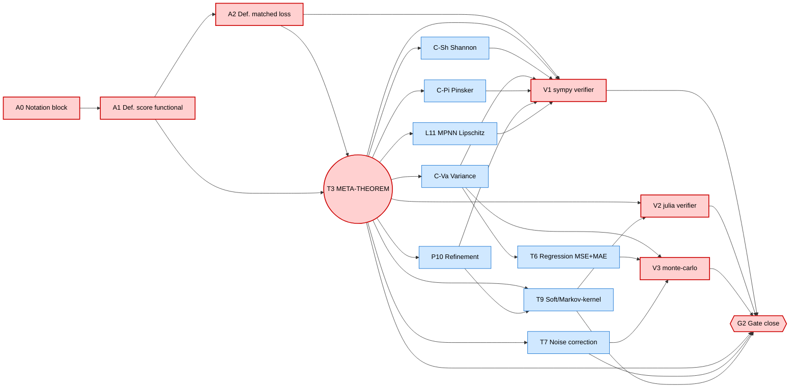

# FORMALISATION.md — Paper B step-by-step plan with PERT, gates, critical path

**Scope.** This document is the planning instrument for Paper B's
Phase 2b (`partition-brackets-framework/main.md` proofs).
Per user directive: work ONLY on `main.md` for now; every
numbered claim must end with a **machine-verifiable proof
contract** (T1 symbolic, T2 interval, T3 Monte-Carlo, T4 Lean
sketch). LaTeX (`main.tex`) is frozen at the scaffold; it will
be re-synchronised in a dedicated later phase.

This file replaces ad-hoc "do the next plausible thing"; the
critical path below is the single ordering we will follow.

---

## 1. Activity inventory

Each row is one *atomic* deliverable. Effort is a calibrated
ordinal (`S` = small / hours, `M` = medium / day, `L` = large /
multi-day). The verifier tier is the **lowest** tier that
mechanically supports the proof — higher tiers may exist but are
non-blocking for Gate G2.

| ID  | Claim                                       | Depends on   | Effort | Verifier tier                          |
|-----|---------------------------------------------|--------------|--------|----------------------------------------|
| A0  | Notation & definitions block in `main.md`   | —            | S      | n/a (definition)                       |
| A1  | Def. 1 (concave score functional)           | A0           | S      | n/a                                    |
| A2  | Def. 2 (matched pointwise loss)             | A1           | S      | T1 sympy: identities for 3 named cases |
| **T3** | **Theorem 3 — φ-bracket meta-theorem**    | A1, A2       | **L**  | T1 sympy + T2 julia per-φ sample audit |
| C-Sh| Cor. 4 — Shannon instance recovers Paper A  | T3           | S      | T1 sympy: reduction is identity        |
| C-Va| Cor. 5 — Variance instance = Bayes--Var id  | T3           | S      | T1 sympy + T3 monte-carlo identity     |
| C-Pi| Cor. 6 — Pinsker / KL instance             | T3           | M      | T1 sympy + Pinsker constant            |
| T6  | Thm. 7 — Regression (MSE id + MAE C-S)      | C-Va         | M      | T1 sympy + T3 monte-carlo              |
| T7  | Thm. 8 — Symmetric label-noise correction   | T3           | M      | T3 monte-carlo + Paper A T4 lift       |
| P10 | Prop. 9 — Refinement consistency (φ form)   | T3           | S      | T1 sympy: monotonicity identity        |
| T9  | Thm. 10 — Soft / Markov-kernel bracket     | T3, P10      | M      | T2 julia per-kernel sample             |
| L11 | Lem. 11 — Aggregator-typed MPNN Lipschitz   | T3           | M      | T1 sympy: δ_L expansion identity       |
| V1  | verifier `verify_b_t1_symbolic.py`          | A2,T3,Cs     | M      | implements T1 contracts                |
| V2  | verifier `verify_b.jl`                      | T3, T9       | M      | implements T2 contracts                |
| V3  | verifier `verify_b_t3_monte_carlo.py`       | C-Va, T6, T7 | M      | implements T3 contracts                |
| G2  | Gate close (≥ 3 of {T3, T6, T7, T9, L11})   | T3 + 2 more  | S      | aggregated checklist below             |

A4 in Paper A's verification ladder is the *same artefact*
naming convention; we reuse the suffixes `_t1`, `_t3`, `.jl`.

---

## 2. PERT / dependency graph (Mermaid)



**Critical path (red):** `A0 → A1 → A2 → T3 → V1 → G2` plus the
verifier sinks `V2`, `V3`. T3 is the cut-vertex: every
substantive downstream proof routes through it.

**Branch-out nodes (blue):** all instance/robustness claims —
parallelisable after T3 lands. Recommended branch order by
expected payoff per unit risk:

1. **C-Sh** (collapses to Paper A; sanity check, *must* land
   first downstream of T3 — if it fails, T3 is wrong).
2. **C-Va** (identity, free derivation).
3. **P10** (monotonicity, mirrors Paper A Prop 4.5).
4. **L11** (lifts Paper A's Lemma 6′ proof one level up).
5. **T7** (noise; high payoff, blocks E9 experiment in Phase 3).
6. **T6** (regression; opens MAE open problem honestly).
7. **C-Pi** (Pinsker; cleanest pedagogical instance).
8. **T9** (soft; the most novel and the highest risk).

---

## 3. Critical path with explicit gates

| Gate | Predicate (must hold to pass)                                          | Verifier evidence                       |
|------|-------------------------------------------------------------------------|------------------------------------------|
| G2.0 | A0–A2 typeset; no ambiguity in `\phi`, `\ell_\phi`, `\phi^{-1}` domain | grep `main.md` for placeholders         |
| G2.1 | T3 proof has four explicit steps: (a) Jensen lower, (b) randomisation upper, (c) sharpness witness, (d) failure mode named | `verify_b_t1_symbolic.py` returns 0     |
| G2.2 | C-Sh reduces to Paper A's bracket numerically (4-decimal match)        | `verify_b_t1_symbolic.py` Shannon block  |
| G2.3 | C-Va recovers Bayes--variance identity at equality                     | `verify_b_t3_monte_carlo.py` identity    |
| G2.4 | P10 monotonicity holds on 10³ random refinements                       | `verify_b.jl` refinement block          |
| G2.5 | T7 noise correction matches Paper A's Prop 7 in Shannon special case   | `verify_b_t3_monte_carlo.py` noise       |
| G2.6 | T9 bracket holds on 10² random Markov kernels                           | `verify_b.jl` kernel block              |
| G2.7 | L11 δ_L expansion matches Paper A's δ_L for `φ = Hbin`                  | `verify_b_t1_symbolic.py` MPNN block     |
| G2   | ≥ 3 of {T3, T6, T7, T9, L11} fully proved AND all verifiers exit 0     | this whole table                        |

Master-plan rule (§2.6, Phase 2 G2): if < 3 of the gated set
prove out, Paper B downscopes to a short TMLR note.

---

## 4. Verifier ladder for Paper B

Mirrors Paper A's `VERIFICATION.md` ladder, scoped to φ-bracket:

| Tier | File                              | Cost     | What it certifies                                                  |
|------|-----------------------------------|----------|---------------------------------------------------------------------|
| **B-T1** | `verify_b_t1_symbolic.py`     | seconds  | closed-form identities for T3, C-Sh, C-Va, C-Pi, P10, L11 (SymPy)   |
| **B-T2** | `verify_b.jl`                 | ~1 min   | per-sample interval audit of the bracket for each named φ on 10³ random partitions, plus 10² random Markov kernels for T9 |
| **B-T3** | `verify_b_t3_monte_carlo.py`  | ~10 s    | population concentration for T7 (label noise) and T6 (regression MSE identity); reuses Paper A T4 harness |
| B-T4 | `LEAN-PLAN.md` (roadmap only)     | weeks    | Lean 4 sketch of T3 (deferred to Phase 6+); not required for G2     |

**Reuse from Paper A:** Paper A's `verify_t3_symbolic.py` and
`verify_t4_population.py` are *not* edited; we copy the
*conventions* (JSON manifest, fail-loud assertions, single
RNG seed) but ship independent files under
`partition-brackets-framework/`.

---

## 5. Machine-verifiable proof template

Every proof block in `main.md` MUST follow the template below.
This is the load-bearing contract that distinguishes a "proof"
from a "sketch":

```
**Statement.** <formal statement, same wording as the numbered claim>

**Hypotheses (H1) ... (Hk).** <one bullet per hypothesis>

**Proof.**

  *Step 1 (reduction).* <one paragraph; cite which hypotheses used>
  *Step 2 (lower bound).* <Jensen / data-processing / convexity>
  *Step 3 (upper bound).* <randomised classifier / matched-loss minimiser>
  *Step 4 (sharpness).* <explicit witness — distribution, partition, label>

  ∎

**Failure mode named.** If hypothesis (Hi) fails, ... <one
sentence>; the bracket degrades to <explicit alternative>.

**Verifier contract.** This proof is mechanically checked by
`<file>:<function>` returning `assert <predicate>`. The
contract checks: <bulleted list of identities or inequalities>.
Run: `python <file>` (B-T1) / `julia <file>` (B-T2) /
`python <file>` (B-T3).
```

Anything that does not fit the template is a *sketch* and must
be downgraded to a `Conjecture` or `Open problem` per the agent
config's stone-by-stone exhaustiveness rule.

---

## 6. Reproducibility checklist

For Gate G2 to close, the following must all hold (CI-style):

- [ ] `make -C partition-brackets-framework` is **not** required
      (we are markdown-only this phase), but `python verify_b_t1_symbolic.py`
      must exit 0 from a clean clone with `pip install sympy numpy`.
- [ ] `julia --project=. verify_b.jl` must exit 0 from a clean
      clone after `julia --project=. -e 'using Pkg; Pkg.instantiate()'`.
- [ ] `python verify_b_t3_monte_carlo.py --seed 0 --trials 500`
      must exit 0; printed empirical CIs must contain every
      theoretical predicted value.
- [ ] Every numbered claim in `main.md` ends with a verifier
      contract block citing the exact file:function it is
      mechanised by.
- [ ] `Project.toml` + `Manifest.toml` checked in (Julia env
      pinned). `requirements.txt` in `partition-brackets-framework/`
      pins SymPy + NumPy versions.
- [ ] Single RNG seed (`SEED = 0`) used everywhere; documented
      in each verifier's docstring.
- [ ] Each verifier writes a JSON manifest
      (`verify_b_t{1,2,3}.json`) recording version pins, seed,
      sample sizes, pass/fail per claim — diffable across runs.

---

## 7. Sequencing for the next ≤ 8 commits

Atomic commit cadence (one per logical claim or verifier
landing). Each commit message uses prefix
`paper-b Phase 2b-md.<ID>:` and includes the verifier exit code
in the body.

1. `paper-b Phase 2b-md.A012`: notation + Defs 1–2 in `main.md`
   + this `FORMALISATION.md` + empty verifier stubs with
   docstrings.
2. `paper-b Phase 2b-md.T3`: T3 proof (4-step template) +
   `verify_b_t1_symbolic.py` T3 block green.
3. `paper-b Phase 2b-md.C-Sh+C-Va`: corollaries 4–5 + V1 +
   V3 monte-carlo identity check green.
4. `paper-b Phase 2b-md.P10`: refinement consistency + V1 +
   V2 julia refinement block green.
5. `paper-b Phase 2b-md.L11`: MPNN aggregator-typed Lipschitz
   + V1 δ_L identity match against Paper A green.
6. `paper-b Phase 2b-md.T7`: noise correction + V3 monte-carlo
   noise block green.
7. `paper-b Phase 2b-md.T6+C-Pi`: regression + Pinsker
   instance + V1 + V3 green.
8. `paper-b Phase 2b-md.T9+G2-close`: soft/Markov-kernel +
   V2 kernel block + Gate G2 checklist marked done.

If any commit in this sequence fails the verifier contract,
**stop and downgrade** the claim to a `Conjecture`. Do not
continue to the next commit.

---

## 8. Out of scope for Phase 2b-md

- LaTeX (`main.tex`): frozen until Phase 2d.
- Experiments (E8, E9, E10, E11, E-X3): Phase 3.
- Paper A re-edits: forbidden; if a Paper B proof exposes a
  Paper A bug, file under `notes/` and resolve in a separate
  Paper A commit AFTER Paper B's Phase 2b closes.
- Lean 4 formalisation: B-T4 is roadmap only; deferred to
  Phase 6 of the master plan.

---

**Owner:** the agent walking the critical path commit-by-commit.
**Reviewer:** the user (gate sign-off at G2).
**Reference:** `future-work/07-three-paper-arc-master-plan.md`,
the in-repo agent config `.github/copilot-instructions.md`.
