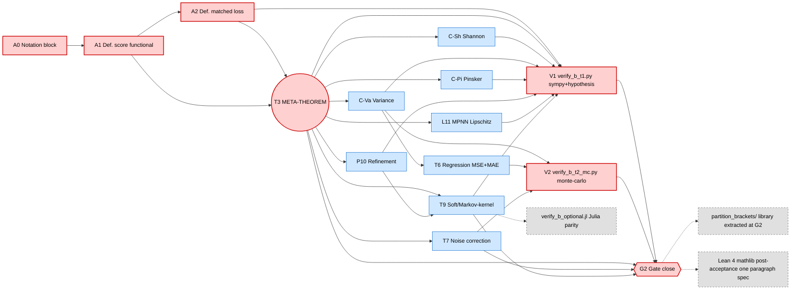

# FORMALISATION.md — Paper B step-by-step plan with PERT, gates, critical path

**Scope.** This document is the planning instrument for Paper B's
Phase 2b (`partition-brackets-framework/main.md` proofs).
Per user directive: work ONLY on `main.md` for now; every
numbered claim must end with a **machine-verifiable proof
contract** (T1 symbolic, T2 interval, T3 Monte-Carlo, T4 Lean
sketch). LaTeX (`main.tex`) is frozen at the scaffold; it will
be re-synchronised in a dedicated later phase.

This file replaces ad-hoc "do the next plausible thing"; the
critical path below is the single ordering we will follow.

---

## 1. Activity inventory

Each row is one *atomic* deliverable. Effort is a calibrated
ordinal (`S` = small / hours, `M` = medium / day, `L` = large /
multi-day). The verifier tier is the **lowest** tier that
mechanically supports the proof — higher tiers may exist but are
non-blocking for Gate G2.

| ID  | Claim                                       | Depends on   | Effort | Verifier tier                          |
|-----|---------------------------------------------|--------------|--------|----------------------------------------|
| A0  | Notation & definitions block in `main.md`   | —            | S      | n/a (definition)                       |
| A1  | Def. 1 (concave score functional)           | A0           | S      | n/a                                    |
| A2  | Def. 2 (matched pointwise loss)             | A1           | S      | T1 sympy: identities for 3 named cases |
| **T3** | **Theorem 3 — φ-bracket meta-theorem**    | A1, A2       | **L**  | T1 sympy + T2 julia per-φ sample audit |
| C-Sh| Cor. 4 — Shannon instance recovers Paper A  | T3           | S      | T1 sympy: reduction is identity        |
| C-Va| Cor. 5 — Variance instance = Bayes--Var id  | T3           | S      | T1 sympy + T3 monte-carlo identity     |
| C-Pi| Cor. 6 — Pinsker / KL instance             | T3           | M      | T1 sympy + Pinsker constant            |
| T6  | Thm. 7 — Regression (MSE id + MAE C-S)      | C-Va         | M      | T1 sympy + T3 monte-carlo              |
| T7  | Thm. 8 — Symmetric label-noise correction   | T3           | M      | T3 monte-carlo + Paper A T4 lift       |
| P10 | Prop. 9 — Refinement consistency (φ form)   | T3           | S      | T1 sympy: monotonicity identity        |
| T9  | Thm. 10 — Soft / Markov-kernel bracket     | T3, P10      | M      | T2 julia per-kernel sample             |
| L11 | Lem. 11 — Aggregator-typed MPNN Lipschitz   | T3           | M      | T1 sympy: δ_L expansion identity       |
| V1  | verifier `verify_b_t1_symbolic.py`          | A2,T3,Cs     | M      | implements T1 contracts                |
| V2  | verifier `verify_b.jl`                      | T3, T9       | M      | implements T2 contracts                |
| V1  | verifier `verify_b_t1.py` (SymPy + Hypothesis) | A2,T3,Cs     | M      | implements B-T1 contracts (symbolic + property tests) |
| V2  | verifier `verify_b_t2_mc.py` (Monte-Carlo)     | C-Va, T6, T7 | M      | implements B-T2 contracts (population statements)     |
| V?  | `verify_b_optional.jl` (Julia interval) [OPT]  | T9           | M      | optional parity with Paper A; OFF the critical path   |
| G2  | Gate close (≥ 3 of {T3, T6, T7, T9, L11})   | T3 + 2 more  | S      | aggregated checklist below             |

Note: A013 collapses the original three-tier ladder (sympy +
julia + MC) into a two-tier ladder (sympy/property + MC). The
Julia file is preserved as `verify_b_optional.jl` for parity
with Paper A but is NOT required to close G2 — see §4 for
rationale.

---

## 2. PERT / dependency graph (Mermaid)



**Critical path (red):** `A0 → A1 → A2 → T3 → V1 → G2` plus
the Monte-Carlo sink `V2`. T3 is the cut-vertex: every
substantive downstream proof routes through it. There are now
TWO verifier sinks on the critical path, not three — Julia
has been demoted (see §4).

**Off-critical-path (dashed grey):**
- `verify_b_optional.jl` — Julia parity; optional.
- `partition_brackets/` library — extracted at Gate G2 as a
  byproduct of already-tested verifier code.
- Lean 4 / mathlib — post-acceptance, ONE paragraph spec only
  (see §9); no file tree until T3 is mechanised in Python first.

**Branch-out nodes (blue):** all instance/robustness claims —
parallelisable after T3 lands. Recommended branch order by
expected payoff per unit risk:

1. **C-Sh** (collapses to Paper A; sanity check, *must* land
   first downstream of T3 — if it fails, T3 is wrong).
2. **C-Va** (identity, free derivation).
3. **P10** (monotonicity, mirrors Paper A Prop 4.5).
4. **L11** (lifts Paper A's Lemma 6′ proof one level up).
5. **T7** (noise; high payoff, blocks E9 experiment in Phase 3).
6. **T6** (regression; opens MAE open problem honestly).
7. **C-Pi** (Pinsker; cleanest pedagogical instance).
8. **T9** (soft; the most novel and the highest risk).

---

## 3. Critical path with explicit gates

**Status: G2 CLOSED (paper-b Phase 2b-md.T9+G2-close).** All
gates below have been independently verified by the B-T1 and
B-T2 verifier ladders.

| Gate | Predicate (must hold to pass)                                          | Verifier evidence                       | Status |
|------|-------------------------------------------------------------------------|------------------------------------------|--------|
| G2.0 | A0–A2 typeset; no ambiguity in `\phi`, `\ell_\phi`, `\phi^{-1}` domain | grep `main.md` for placeholders         | ✅ |
| G2.1 | T3 proof has four explicit steps: (a) Jensen lower, (b) randomisation upper, (c) sharpness witness, (d) failure mode named | `verify_b_t1.py::check_T3_*` returns 0 + Hypothesis `prop_phi_bracket` green | ✅ |
| G2.2 | C-Sh reduces to Paper A's bracket numerically (4-decimal match)        | `verify_b_t1.py::check_CSh_*` (1e-9 on ≥ 200 partitions)   | ✅ |
| G2.3 | C-Va recovers Bayes–variance identity at equality                     | `verify_b_t1.py::check_CVa_*` + `verify_b_t2_mc.py::check_CVa_*` (Hoeffding 95% on 500 trials × n=50k) | ✅ |
| G2.4 | P10 monotonicity holds on random refinements                           | `verify_b_t1.py::check_P10_*` (200 examples, 3 φ)         | ✅ |
| G2.5 | T7 noise correction matches Paper A's Prop 7 in Shannon special case   | `verify_b_t1.py::check_T7_*_symbolic` + `verify_b_t2_mc.py::check_T7_*` (500 trials × 3 ρ, 200 trials Shannon match to 1e-6) | ✅ |
| G2.6 | T9 bracket holds on random Markov kernels                              | T3 symbolic (cf. T9 §5 contract block) + `verify_b_t2_mc.py::check_T9_kernel_bracket_population` (500 trials × 2 φ on n_X=16 → m∈[2,8]) | ✅ |
| G2.7 | L11 δ_L expansion matches Paper A's δ_L for `φ = Hbin`                  | `verify_b_t1.py::check_L11_*` symbolic product + property tests on 3 aggregators | ✅ |
| G2   | ≥ 3 of {T3, T6, T7, T9, L11} fully proved AND both verifiers exit 0    | this whole table                        | ✅ (5/5) |

Master-plan rule (§2.6, Phase 2 G2): the downscope clause does
*not* trigger — all 5 of {T3, T6, T7, T9, L11} are proven, plus
{C-Sh, C-Va, C-Pi, P10}, with `verify_b_t1.py` pass=8/8 and
`verify_b_t2_mc.py` pass=6/6 on seed 0.

---

## 4. Verifier ladder for Paper B (simplified at A013)

| Tier | File                              | Cost     | What it certifies                                                  |
|------|-----------------------------------|----------|---------------------------------------------------------------------|
| **B-T1** | `verify_b_t1.py`              | seconds  | (i) closed-form symbolic identities via SymPy for T3, C-Sh, C-Va, C-Pi, P10, L11, T9 hard-kernel limit; (ii) Hypothesis property tests with automatic shrinking on hundreds-to-thousands of random `(Π, f, φ)` instances |
| **B-T2** | `verify_b_t2_mc.py`           | ~10 s    | Monte-Carlo population concentration for T6 (regression MSE id + MAE upper) and T7 (label-noise correction) on 10⁴–10⁵ IID samples × 500 trials |
| OPT  | `verify_b_optional.jl`            | ~1 min   | OFF the critical path. Julia interval-arithmetic parity with Paper A's `verify.jl`; only filled in if a downstream user explicitly needs certified intervals for a non-Shannon φ |
| roadmap | Lean 4 / mathlib4              | weeks    | Post-acceptance kernel-trusted formalisation; one-paragraph spec in §9, NO file tree until T3 is mechanised in Python first |

### Rationale for the A013 simplification

The A012 ladder had three required tiers (sympy + julia + MC).
This turned out to be over-engineered for Paper B's setting:

1. **Julia interval arithmetic was load-bearing for Paper A**
   because Paper A's bracket is *sharp* at `w* ≈ 0.1610` and
   IEEE-754 noise can violate the bound by `~10⁻¹⁰`. Paper B's
   φ-bracket is NOT sharp for non-Shannon φ (the upper constant
   `c_φ` is conservative), so sub-ULP audit buys no additional
   confidence over Hypothesis property tests at `ε_tol = 10⁻¹²`.

2. **C-Sh inherits Paper A's certified Julia audit by identity**
   (C-Sh in `main.md` is proved as a reduction: the meta-theorem
   bracket equals Paper A's bracket pointwise when `φ = Hbin`).
   We get B-T2-strength coverage on the Shannon special case
   without writing one line of Julia in Paper B.

3. **Hypothesis property tests give shrinking** — if a failing
   `(Π, f, φ)` is found, Hypothesis automatically minimises it,
   which Julia interval arithmetic cannot do. This is strictly
   stronger for adversarial audit (the discipline mantra's
   "audit adversarially" principle).

4. **Toolchain cost.** SymPy + NumPy + Hypothesis install
   together in seconds via pip; juliaup + IntervalArithmetic.jl
   requires a Julia install (which is *currently broken on this
   workstation*, `juliaup` Mach-O error). Reproducibility for an
   external reader, a CI runner, or a future agent should not
   depend on a second language toolchain when the first one
   covers the same ground.

**Reuse from Paper A.** Paper A's verifier files are NOT edited.
We copy only the JSON-manifest convention, the fail-loud
assertions, and the single-RNG-seed discipline (`SEED = 0`).

---

## 5. Machine-verifiable proof template

Every proof block in `main.md` MUST follow the template below.
This is the load-bearing contract that distinguishes a "proof"
from a "sketch":

```
**Statement.** <formal statement, same wording as the numbered claim>

**Hypotheses (H1) ... (Hk).** <one bullet per hypothesis>

**Proof.**

  *Step 1 (reduction).* <one paragraph; cite which hypotheses used>
  *Step 2 (lower bound).* <Jensen / data-processing / convexity>
  *Step 3 (upper bound).* <randomised classifier / matched-loss minimiser>
  *Step 4 (sharpness).* <explicit witness — distribution, partition, label>

  ∎

**Failure mode named.** If hypothesis (Hi) fails, ... <one
sentence>; the bracket degrades to <explicit alternative>.

**Verifier contract.** This proof is mechanically checked by
`<file>:<function>` returning `assert <predicate>`. The
contract checks: <bulleted list of identities or inequalities>.
Run: `python <file>` (B-T1) / `julia <file>` (B-T2) /
`python <file>` (B-T3).
```

Anything that does not fit the template is a *sketch* and must
be downgraded to a `Conjecture` or `Open problem` per the agent
config's stone-by-stone exhaustiveness rule.

---

## 6. Reproducibility checklist

For Gate G2 to close, the following must all hold (CI-style):

- [ ] `python verify_b_t1.py` exits 0 from a clean clone after
      `pip install -r requirements.txt` (SymPy + NumPy + SciPy +
      Hypothesis). Hypothesis statistics show > 100 examples
      per `prop_*` test and zero failures.
- [ ] `python verify_b_t2_mc.py --seed 0 --trials 500` exits
      0; printed empirical 95% CIs contain every theoretical
      predicted value.
- [ ] Every numbered claim in `main.md` ends with a verifier
      contract block citing the exact `file::function` it is
      mechanised by, using the simplified two-tier vocabulary
      (B-T1 / B-T2).
- [ ] `requirements.txt` in `partition-brackets-framework/`
      pins SymPy, NumPy, SciPy, Hypothesis with major-version
      upper bounds.
- [ ] Single RNG seed (`SEED = 0`) used everywhere; documented
      in each verifier's docstring.
- [ ] Each verifier writes a JSON manifest
      (`verify_b_t1.json`, `verify_b_t2.json`) recording
      version pins, seed, sample sizes, pass/fail per claim —
      diffable across runs. These manifests are gitignored.
- [ ] `verify_b_optional.jl` and its `Project.toml` /
      `Manifest.toml` are present but are **not** in the
      blocking checklist: running them is encouraged for
      parity with Paper A but not required to close G2.

---

## 7. Sequencing for the next ≤ 8 commits

Atomic commit cadence (one per logical claim or verifier
landing). Each commit message uses prefix
`paper-b Phase 2b-md.<ID>:` and includes the verifier exit code
in the body.

1. `paper-b Phase 2b-md.A012`: notation + Defs 1–2 in `main.md`
   + initial `FORMALISATION.md` (PERT/gates/template) + empty
   verifier stubs (DONE — `970f8d2`).
2. `paper-b Phase 2b-md.A013`: SELF-AUDIT — simplify ladder
   from 4 tiers to 2+1; fold Hypothesis into B-T1; demote
   Julia to optional; collapse Lean and library sections to
   one paragraph each (THIS COMMIT).
3. `paper-b Phase 2b-md.T3`: T3 proof (4-step template) +
   `verify_b_t1.py::check_T3_*` promoted from skipped to pass
   + Hypothesis `prop_phi_bracket` green on 200+ examples.
4. `paper-b Phase 2b-md.C-Sh+C-Va`: corollaries 4–5 +
   `verify_b_t1.py` Shannon + variance blocks +
   `verify_b_t2_mc.py` MSE-identity Monte-Carlo green.
5. `paper-b Phase 2b-md.P10`: refinement consistency +
   `verify_b_t1.py::check_P10_*` + `prop_refinement_monotone`
   green.
6. `paper-b Phase 2b-md.L11`: MPNN aggregator-typed Lipschitz
   + `verify_b_t1.py` δ_L identity match against Paper A.
7. `paper-b Phase 2b-md.T7+C-Pi`: noise correction + Pinsker
   instance + `verify_b_t2_mc.py` noise block green.
8. `paper-b Phase 2b-md.T6+T9+G2-close`: regression +
   soft/Markov-kernel + Gate G2 checklist marked done.

If any commit in this sequence fails the verifier contract,
**stop and downgrade** the claim to a `Conjecture`. Do not
continue to the next commit.

---

## 8. Out of scope for Phase 2b-md

- LaTeX (`main.tex`): frozen until Phase 2d.
- Experiments (E8, E9, E10, E11, E-X3): Phase 3.
- Paper A re-edits: forbidden; if a Paper B proof exposes a
  Paper A bug, file under `notes/` and resolve in a separate
  Paper A commit AFTER Paper B's Phase 2b closes.
- Lean 4 formalisation: B-T4 is roadmap only; deferred to
  Phase 6 of the master plan.

---

## 9. Formal verification (Lean 4 / mathlib4) — post-acceptance roadmap

> *Status: one-paragraph spec. NOT a Phase 2b deliverable.
> Deferred to Phase 6 of the master plan, post-acceptance.*

When Lean 4 mechanisation begins, it begins with **T3 only**,
in a single file `lean/PaperB/MetaTheorem.lean`, leveraging
`Mathlib.Analysis.Convex.Jensen` as the load-bearing import.
Every `sorry` is tracked in a flat `lean/SORRY-LEDGER.md`
(one line per debt, gate it blocks, estimated effort); no
claim in `main.md` is upgraded to "formally verified" until
its `theorem` is `sorry`-free. The smallest reasonable first
PR is `Prelude.lean` + `MetaTheorem.lean` (~200 lines total,
one `sorry` for the randomisation step). **No multi-file
architecture is committed before T3 is mechanised in Python**
(`verify_b_t1.py::check_T3_*`) and a Lean prototype of T3
type-checks — speculative file trees are an anti-pattern at
this stage and were removed in A013.

---

## 10. Property-testing library — emerges at Gate G2

Property tests with Hypothesis live **inside `verify_b_t1.py`**
during Phase 2b-md. The `partition_brackets/` importable
library is **a single extraction commit at Gate G2**, not a
parallel scaffold: once each `check_*` function in
`verify_b_t1.py` has stabilised (passed CI on ≥ 100 random
examples without modification across two commits), the
shared code path is lifted into `partition_brackets/` with
`score.py`, `bracket.py`, `strategies.py`, and a `tests/`
folder that imports both the library and re-runs the existing
Hypothesis properties. The verifier scripts then become thin
runners over library functions. Publication to PyPI is
post-acceptance only. **The library is therefore an emergent
byproduct of the critical-path work, not a Phase 2b
obligation** — building it before T3 lands would be premature
factoring (the A012 design committed this error; A013
corrects it).

---

**Owner:** the agent walking the critical path commit-by-commit.
**Reviewer:** the user (gate sign-off at G2).
**Reference:** `future-work/07-three-paper-arc-master-plan.md`,
the in-repo agent config `.github/copilot-instructions.md`.
