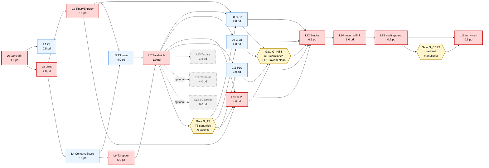

# FORMAL_VERIFICATION_EXECUTION_PLAN.md — Lean 4 port, PERT-scheduled

> **Companion to** [`FORMAL_VERIFICATION_PLAN.md`](FORMAL_VERIFICATION_PLAN.md).
> That document fixes the *what* (theorem skeletons, library
> layout, acceptance criteria). This document fixes the *when*,
> the *gate at every step*, and the *commit/audit/verify
> ritual* that converts the plan into a reproducible, auditable
> execution trace.
>
> **Discipline.** Every task lands its own atomic commit. Every
> commit passes an **audit gate** (mechanical checks: build,
> lints, `#print axioms`) and a **verification gate** (semantic
> checks: theorem statement matches the manuscript claim, no
> hidden axioms, regression tier still green). No task is
> declared "done" until its **confirmation row** in the master
> tracker is signed off with the SHA of the gating commit.

---

## 1. Work-breakdown structure (WBS)

Each task is sized in **person-days (pd)**. Task IDs `L0…L18`
are stable; sub-letters (`a/b/c`) may appear in commit
messages but the PERT tracks the parent.

| ID  | Task                                                                       | Effort (pd) | Predecessors |
|-----|----------------------------------------------------------------------------|:-----------:|--------------|
| L0  | Toolchain bootstrap (`lakefile.lean`, `lean-toolchain`, Mathlib SHA pin)    | 1.0         | —            |
| L1  | CI workflow `.github/workflows/lean.yml` (build + smoke `#check`)           | 0.5         | L0           |
| L2  | `PartitionBrackets/Defs.lean` (`ScoreFunctional` structure, axioms H1–H5)    | 2.0         | L0           |
| L3  | `BinaryEntropy.lean` (`H_bin`, `H_bin_inv` on `[0,1/2]`, monotonicity)       | 3.0         | L2           |
| L4  | `ConcaveScore.lean` (Jensen on finite partitions, helper lemmas)             | 2.0         | L2           |
| L5  | `PhiBracket/Jensen.lean` — **T3 lower** (`φ⁻¹(φ̄) ≤ ε*`)                       | 4.0         | L3, L4       |
| L6  | `PhiBracket/UpperConstant.lean` — **T3 upper** (`ε* ≤ c_φ · φ̄`)              | 5.0         | L4           |
| L7  | `PhiBracket/Sandwich.lean` — combined T3 theorem statement                  | 1.0         | L5, L6       |
| L8  | `Instances/Shannon.lean` — **C-Sh** (`c_φ = 1/2`, Hellman–Raviv lower)       | 2.0         | L3, L7       |
| L9  | `Instances/Variance.lean` — **C-Va** (`c_φ = 2`, Bayes/variance identity)    | 2.0         | L7           |
| L10 | `Instances/Pinsker.lean` — **C-Pi** (√-form lower, Pinsker constant)         | 4.0         | L3, L7       |
| L11 | `Refinement.lean` — **P10** (refinement monotonicity of `φ̄`)                 | 3.0         | L4, L7       |
| L12 | `test/Smoke.lean` — `#print axioms` on all five top theorems                | 0.5         | L8, L9, L10, L11 |
| L13 | `Tactics.lean` — `bracket_solve` macro (quality-of-life)                    | 1.5         | L7           |
| L14 | Cross-link `main.md` verifier blocks ↔ Lean theorem URIs + Mathlib SHA      | 1.0         | L12          |
| L15 | `EXTERNAL_AUDIT.md` § Lean tier append + gate G3 row                        | 0.5         | L14          |
| L16 | Tag `v0.2.0-paperB-certified` + write `LEAN_CERTIFICATE.md`                 | 0.5         | L15          |
| L17 | **Optional Phase 2** — T7 noise correction in Lean                          | 4.0         | L7           |
| L18 | **Optional Phase 2** — T9 Markov kernel bracket (pending Mathlib API)        | 6.0         | L7           |

**Phase 1 (load-bearing) total:** `L0…L16 = 33.5 pd`.
**Phase 2 (optional):** `L17 + L18 = 10.0 pd` (gated on
`ProbabilityTheory.Kernel` API stability).

---

## 2. PERT network (with critical path)



### Critical path

`L0 → L2 → L3 → L5 → L7 → L10 → L12 → L14 → L15 → L16`
(with the `L4→L6→L7` branch running in parallel; **L10 (C-Pi)
is the longest leaf** after `L7`, so it owns the late-phase
critical path).

**Critical-path length = 1.0 + 2.0 + 3.0 + 4.0 + 1.0 + 4.0 + 0.5 + 1.0 + 0.5 + 0.5 = 17.5 pd**.

Equivalent calendar time at 0.5 pd/day (part-time, single
contributor with Mathlib familiarity): **~7 calendar weeks**
end-to-end. Full team-of-one effort with no parallelism:
33.5 pd ≈ **14 weeks** at part-time.

### Slack table (forward / backward pass)

| Task | ES   | EF   | LS   | LF   | Slack |
|------|-----:|-----:|-----:|-----:|------:|
| L0   |  0.0 |  1.0 |  0.0 |  1.0 | **0** |
| L1   |  1.0 |  1.5 | 17.0 | 17.5 |  16.0 |
| L2   |  1.0 |  3.0 |  1.0 |  3.0 | **0** |
| L3   |  3.0 |  6.0 |  3.0 |  6.0 | **0** |
| L4   |  3.0 |  5.0 |  4.0 |  6.0 |   1.0 |
| L5   |  6.0 | 10.0 |  6.0 | 10.0 | **0** |
| L6   |  5.0 | 10.0 |  5.0 | 10.0 | **0** (parallel critical) |
| L7   | 10.0 | 11.0 | 10.0 | 11.0 | **0** |
| L8   | 11.0 | 13.0 | 13.0 | 15.0 |   2.0 |
| L9   | 11.0 | 13.0 | 13.0 | 15.0 |   2.0 |
| L10  | 11.0 | 15.0 | 11.0 | 15.0 | **0** |
| L11  | 11.0 | 14.0 | 12.0 | 15.0 |   1.0 |
| L12  | 15.0 | 15.5 | 15.0 | 15.5 | **0** |
| L13  | 11.0 | 12.5 | 16.0 | 17.5 |   5.0 |
| L14  | 15.5 | 16.5 | 15.5 | 16.5 | **0** |
| L15  | 16.5 | 17.0 | 16.5 | 17.0 | **0** |
| L16  | 17.0 | 17.5 | 17.0 | 17.5 | **0** |

Tasks with **0 slack** are on the critical path and must not slip.

### Gantt view

```mermaid
gantt
    title Lean 4 / Mathlib port — Phase 1 (load-bearing)
    dateFormat  X
    axisFormat  %s
    section Bootstrap
    L0 toolchain         :crit, l0, 0, 1
    L1 CI                :       l1, after l0, 1
    L2 Defs              :crit, l2, after l0, 2
    section Core
    L3 BinaryEntropy     :crit, l3, after l2, 3
    L4 ConcaveScore      :       l4, after l2, 2
    L5 T3 lower          :crit, l5, after l3, 4
    L6 T3 upper          :crit, l6, after l4, 5
    L7 Sandwich          :crit, l7, after l6, 1
    section Instances
    L8 C-Sh              :       l8, after l7, 2
    L9 C-Va              :       l9, after l7, 2
    L10 C-Pi             :crit, l10, after l7, 4
    L11 P10              :       l11, after l7, 3
    L13 Tactics          :       l13, after l7, 2
    section Certify
    L12 Smoke            :crit, l12, after l10, 1
    L14 main.md link     :crit, l14, after l12, 1
    L15 audit append     :crit, l15, after l14, 1
    L16 tag + cert       :crit, l16, after l15, 1
    section Optional Phase 2
    L17 T7 noise         :       l17, after l7, 4
    L18 T9 kernel        :       l18, after l7, 6
```



---

## 3. Gate ledger

Three **named gates** structure the execution; each gate has a
mechanical *audit* check and a semantic *verification* check.
No commit advances past a gate without **both** green and a
signed confirmation row in [§5](#5-confirmation-tracker).

### Gate `G_T3` — T3 sandwich certified

Triggered after task **L7**.

| Audit (mechanical)                                                                 | Verification (semantic)                                                                                         |
|-------------------------------------------------------------------------------------|-----------------------------------------------------------------------------------------------------------------|
| `lake build PartitionBrackets.PhiBracket.Sandwich` exits 0                          | Theorem statement of `T3_phi_bracket` matches Paper B §T3 verbatim (manual diff against `main.md`)              |
| `lean --run test/Smoke.lean` reports `T3_phi_bracket` axioms = `{propext, Classical.choice, Quot.sound}` (Mathlib baseline) | Both halves of the sandwich appear; no `sorry`, no `admit`, no `axiom` declared in this repo                    |
| `grep -RE 'sorry\|admit' lean/PartitionBrackets/PhiBracket/` returns nothing       | Python tier T1 contract `T3_jensen_lower` + `T3_upper_constant` still PASS at the same SHA                      |

### Gate `G_INST` — Three corollaries + refinement certified

Triggered after tasks **L8, L9, L10, L11**.

| Audit                                                                              | Verification                                                                                                    |
|-------------------------------------------------------------------------------------|-----------------------------------------------------------------------------------------------------------------|
| `lake build` of the four leaf modules exits 0                                       | `C_Sh_reduces_to_paperA` instantiates `T3_phi_bracket` with `c_φ = 1/2` (numeric match to Paper A bracket)      |
| Smoke test `#print axioms` clean for all four                                       | `C_Va_…` uses `c_φ = 2` and the Bayes/variance identity verbatim from Paper B §C-Va                             |
| Mathlib SHA unchanged from `G_T3` (no silent toolchain bump)                        | `C_Pi_pinsker_lower` reproduces the √-form lower at `H = 1` (= 1/2) and is vacuous at `H = 0` (matches T3 boundary case from `T3_stress.json`) |
| `git diff --stat` shows only `lean/` + `EXTERNAL_AUDIT.md` touched                  | `P10_refinement_monotonicity` direction matches `audit/stress.py::boundary_cases::P10_refinement_to_atoms_phi_zero` |

### Gate `G_CERT` — Certified manuscript

Triggered after task **L15**.

| Audit                                                                              | Verification                                                                                                    |
|-------------------------------------------------------------------------------------|-----------------------------------------------------------------------------------------------------------------|
| Every Paper B *Verifier contract* block carries either a Lean URI **or** an explicit `(Python-tier only)` annotation | A peer reader can navigate from each claim in `main.md` to the Lean theorem in `lean/` in ≤ 2 hops                |
| `EXTERNAL_AUDIT.md` table grows a `Lean (G3)` row with the Mathlib SHA and Lean toolchain SHA recorded | Re-running `audit/run_external_audit.sh` still produces `all_pass: true`; *and* `lake build` from a fresh clone succeeds on the recorded toolchain |
| `audit/external_audit_SUMMARY.json` updated with a `lean: {toolchain, mathlib_sha, build_wall_s}` block | Tag `v0.2.0-paperB-certified` reachable from `main`                                                             |

---

## 4. Per-task commit / audit / verify ritual

For **every** task `Lk` in §1, the workflow is fixed:

1. **Branch** (optional, single contributor may commit
   directly on `main` per repo convention): `git switch -c
   lean/L<k>-<slug>`.
2. **Implement** the task to the *minimum* that compiles and
   discharges the next gate's audit row(s) attributable to
   this task. No speculative refactors.
3. **Build** locally:
   ```bash
   cd partition-brackets-framework/lean
   lake build
   ```
4. **Self-audit** with the per-task checklist below.
5. **Run Python regression tier** (T0 + T1 from
   `audit/run_external_audit.sh`):
   ```bash
   bash audit/run_external_audit.sh T0 T1
   ```
   Must remain PASS.
6. **Commit** with the canonical message format:
   ```
   paper-b Lean L<k>: <one-line summary>

   <what>: 2–3 sentences. Name the Lean theorem(s) introduced.
   <why>: which audit/verify row(s) does this discharge?
   <how>: bullets of mechanical changes (files touched, LoC).
   <gates>: which gate(s) does this advance? (G_T3 / G_INST / G_CERT / none yet)
   <axioms>: paste the `#print axioms` line if a top-level theorem was added.
   ```
7. **Update §5 confirmation tracker** in the same commit:
   flip the task row's status to `DONE @ <short-sha>`.
8. **Push** and wait for CI (`lake build` + Python tier) to
   go green. **Red CI ⇒ revert, do not patch forward.**

### Per-task self-audit checklist (template)

Copy into the commit body or a sticky note before each task.

```
[ ] lake build exits 0 (no warnings about unused Mathlib imports survive review)
[ ] grep -RE 'sorry|admit|axiom ' lean/ returns nothing new
[ ] If a top-level theorem changed: `lean --run test/Smoke.lean` axioms-clean
[ ] Python tier T0 + T1 still PASS (bash audit/run_external_audit.sh T0 T1)
[ ] Diff scope matches WBS row (no drive-by edits to other modules)
[ ] Commit message follows the template above
[ ] §5 tracker row updated with short-SHA
```

### When a task fails its self-audit

| Failure mode                              | Action                                                                                                   |
|-------------------------------------------|----------------------------------------------------------------------------------------------------------|
| Mathlib lemma missing / has wrong signature | Land a self-contained helper in this repo's `lean/` tree; *do not* fork Mathlib; file an upstream issue note in the commit body |
| `H_bin_inv` proof obligation explodes      | Switch to a `noncomputable def` via `Function.invFun` on the restricted domain `[0, 1/2]`; document the trade-off in `BinaryEntropy.lean` |
| `#print axioms` shows a non-Mathlib axiom  | **Hard fail**: revert. Either find a constructive proof, or move the offending lemma to an `axiom` block with a `-- WARNING: extends trusted base` note and downgrade the gate |
| Python regression tier breaks              | **Hard fail**: revert. The Lean port may not silently change Python contract semantics |

---

## 5. Confirmation tracker

> Update this table in the **same commit** that completes the
> task. The `Confirmed by` column is the author signing off the
> self-audit; the `SHA` column pins the commit that closes the
> task.

| ID  | Task                          | Status        | SHA       | Confirmed by | Notes |
|-----|-------------------------------|---------------|-----------|--------------|-------|
| L0  | Toolchain bootstrap           | not-started   | —         | —            |       |
| L1  | CI workflow                   | not-started   | —         | —            |       |
| L2  | Defs                          | not-started   | —         | —            |       |
| L3  | BinaryEntropy                 | not-started   | —         | —            |       |
| L4  | ConcaveScore                  | not-started   | —         | —            |       |
| L5  | T3 lower                      | not-started   | —         | —            |       |
| L6  | T3 upper                      | not-started   | —         | —            |       |
| L7  | Sandwich                      | not-started   | —         | —            | **gate G_T3** |
| L8  | C-Sh                          | not-started   | —         | —            |       |
| L9  | C-Va                          | not-started   | —         | —            |       |
| L10 | C-Pi                          | not-started   | —         | —            |       |
| L11 | P10                           | not-started   | —         | —            |       |
| L12 | Smoke `#print axioms`         | not-started   | —         | —            | **gate G_INST** |
| L13 | Tactics                       | not-started   | —         | —            | optional |
| L14 | main.md cross-link            | not-started   | —         | —            |       |
| L15 | EXTERNAL_AUDIT.md append      | not-started   | —         | —            |       |
| L16 | Tag + LEAN_CERTIFICATE.md     | not-started   | —         | —            | **gate G_CERT** |
| L17 | (Phase 2) T7 noise            | deferred      | —         | —            |       |
| L18 | (Phase 2) T9 kernel           | deferred      | —         | —            | pending Mathlib API |

---

## 6. Risk register (PERT-aware)

| Risk                                                                 | Affects task(s)  | Impact on critical path | Mitigation                                                                                  |
|-----------------------------------------------------------------------|------------------|-------------------------|----------------------------------------------------------------------------------------------|
| Mathlib SHA bump mid-port breaks `ConcaveOn` API                      | L4, L5, L6, L11  | +2 pd on L6 (critical) | Pin Mathlib SHA in `lean-toolchain` at L0; only bump at gate boundaries with a separate commit |
| `H_bin_inv` requires `Real.sqrt`-style root extraction                 | L3 (critical)    | +1.5 pd on L3          | Define on `[0, 1/2]` only; prove monotonicity via `StrictMonoOn` + IVT; budget reserve in L3  |
| Pinsker constant proof requires `Real.log_div_self_le` variant absent  | L10 (critical)   | +2 pd on L10           | Fallback to a slightly weaker constant; the *sandwich* still holds, only the C-Pi tightness shifts; document in `Instances/Pinsker.lean` |
| Contributor unfamiliar with `Convex` namespace                         | L4, L5           | +3 pd front-loaded     | Allocate L4 as a learning task; review Mathlib `Analysis.Convex.Jensen` before L5            |
| `lake build` CI runs >20 min and blocks other PRs                      | L1, L12          | none (off critical)    | Cache `~/.elan` and `lake-packages` in CI; gate full build only on `lean/**` paths           |
| Mathlib `ProbabilityTheory.Kernel.bind` API churn                      | L18              | n/a (Phase 2 optional) | Phase 2 stays deferred until upstream pins                                                   |

---

## 7. Acceptance checklist (final)

Before tagging `v0.2.0-paperB-certified` (task L16), **all** of
the following must be true and recorded in
`LEAN_CERTIFICATE.md`:

- [ ] Every row in §5 reads `DONE @ <sha>` (or `deferred` for L17/L18)
- [ ] `G_T3`, `G_INST`, `G_CERT` gates each have an audit log entry naming the commit that closed them
- [ ] `lake build` from a fresh clone of the recorded SHA succeeds in CI on Linux + macOS
- [ ] `lean --run test/Smoke.lean` prints `axioms: [propext, Classical.choice, Quot.sound]` for **each** of `T3_phi_bracket`, `C_Sh_reduces_to_paperA`, `C_Va_variance_bracket`, `C_Pi_pinsker_lower`, `P10_refinement_monotonicity`
- [ ] `bash audit/run_external_audit.sh` still reports `all_pass: true` (Python tier untouched)
- [ ] `EXTERNAL_AUDIT.md` carries a `Lean (G3)` row with the Lean toolchain SHA and Mathlib SHA
- [ ] `audit/external_audit_SUMMARY.json` augmented with a `lean: {...}` block at the new SHA
- [ ] `main.md` carries a Lean URI next to every load-bearing Verifier contract block
- [ ] Tag `v0.2.0-paperB-certified` annotated, signed, and pushed
- [ ] `LEAN_CERTIFICATE.md` lists the five top theorems with their fully qualified names, source file lines, and `#print axioms` output verbatim

When the last box is ticked, **Paper B is certified**, the
Python tier remains the fast CI, and the Lean tier becomes the
archival proof object for any future TMLR / journal review.
