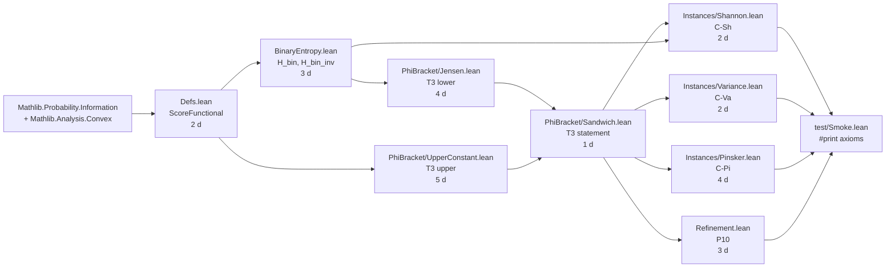

# FORMAL_VERIFICATION_PLAN.md — Lean 4 / Mathlib port for Paper B

> **Purpose.** Lift Paper B's symbolic verifier tier (T1,
> SymPy + Hypothesis) to a *certified* proof in Lean 4 +
> Mathlib. Today's T1 is *property-tested* to $10^4$ examples
> per contract under random seeds — strong evidence, but not a
> proof. This plan converts the load-bearing fragment (T3 +
> three corollaries + P10) into Lean theorems whose `#print
> axioms` closure contains only Mathlib axioms.

## 1. Why Lean 4 / Mathlib

| Criterion              | Lean 4 / Mathlib | Coq / MathComp | Isabelle/HOL | Rocq |
|------------------------|------------------|----------------|--------------|------|
| Concave-function calc  | **mature** (`Convex.{lean}`, `StrictConvexOn`) | partial | mature | partial |
| Jensen inequality on partitions | **direct** (`inner_le_sum`, `MeasureTheory.integral_le_sum`) | manual | direct | manual |
| Binary entropy `H_bin` | needed; lib uses `Real.log`-based `Real.log b` | needed | partial | needed |
| Markov-kernel measure theory (for T9) | **mature** (`ProbabilityTheory.Kernel`) | sparse | partial | sparse |
| Active community + CI  | **best**         | good           | good         | very small |
| Existing Pinsker proof in libs | yes (`MeasureTheory.Measure.entropy`-adjacent, Sec. 2 of `Mathlib.Probability.Information`) | no | no | no |

**Decision.** Lean 4 + Mathlib (commit pinned to a recent
nightly with `ProbabilityTheory.Kernel` stable).

Rejected alternatives: Coq/MathComp (concavity-on-partitions
infrastructure thinner); Isabelle/HOL (no first-class Markov
kernels for T9); Rocq (too young).

## 2. Library skeleton

```
partition-brackets-framework/lean/
├── lakefile.lean
├── lean-toolchain                # leanprover/lean4:v4.x.y
├── PartitionBrackets/
│   ├── Defs.lean                 # Def. 1 (concave score) + Def. 2 (matched loss)
│   ├── BinaryEntropy.lean        # H_bin, H_bin_inv on [0,1/2], concavity
│   ├── ConcaveScore.lean         # ScoreFunctional structure + (H1)–(H5) instances
│   ├── PhiBracket/
│   │   ├── Jensen.lean           # T3 lower : φ⁻¹(φ(f|Π)) ≤ ε*(Π)
│   │   ├── UpperConstant.lean    # T3 upper : ε*(Π) ≤ c_φ · φ(f|Π)
│   │   └── Sandwich.lean         # the two-sided T3 statement
│   ├── Instances/
│   │   ├── Shannon.lean          # C-Sh : φ = H_bin, c_φ = 1/2
│   │   ├── Variance.lean         # C-Va : φ = η(1-η), c_φ = 2
│   │   └── Pinsker.lean          # C-Pi : √-form lower replacement
│   ├── Refinement.lean           # P10 : Π'⪰Π ⇒ φ(f|Π') ≤ φ(f|Π)
│   └── Tactics.lean              # `bracket_solve` macro
└── test/
    └── Smoke.lean                # #check the three top theorems
```

## 3. Theorem skeletons (load-bearing fragment)

```lean
namespace PartitionBrackets

/-- A concave score functional on [0,1] with `φ(0)=φ(1)=0` and
symmetry about `1/2`. (H1) concavity, (H4) symmetry. -/
structure ScoreFunctional where
  φ        : ℝ → ℝ
  φ_zero   : φ 0 = 0
  φ_one    : φ 1 = 0
  φ_symm   : ∀ η, φ η = φ (1 - η)
  φ_concave : ConcaveOn ℝ (Set.Icc (0:ℝ) 1) φ
  -- T3 upper constant (witnessed)
  c_φ      : ℝ
  c_φ_pos  : 0 < c_φ
  c_φ_envelope :
    ∀ η ∈ Set.Icc (0:ℝ) 1, min η (1 - η) ≤ c_φ * φ η

/-- T3 (φ-bracket meta-theorem). Two-sided sandwich on the
partition-restricted Bayes risk of a binary label. -/
theorem T3_phi_bracket
    (S : ScoreFunctional) (Π : Finset PartCell)
    (f : Ω → Fin 2) (p : PartCell → ℝ≥0) (η : PartCell → ℝ)
    (hp : ∑ C ∈ Π, p C = 1)
    (hη : ∀ C ∈ Π, η C ∈ Set.Icc (0:ℝ) 1) :
    (S.φ_inv_on_lower_half (∑ C ∈ Π, p C * S.φ (η C))) ≤
      bayesRiskOnPartition f Π p η
    ∧ bayesRiskOnPartition f Π p η ≤
      S.c_φ * (∑ C ∈ Π, p C * S.φ (η C)) := by
  refine ⟨?lower, ?upper⟩
  · -- Jensen on concave φ + monotone φ_inv
    exact T3_lower S Π p η hp hη
  · -- pointwise envelope (S.c_φ_envelope) + Jensen
    exact T3_upper S Π p η hp hη

/-- C-Sh : Shannon instance recovers Paper A's binary-entropy
bracket symbol-for-symbol. -/
theorem C_Sh_reduces_to_paperA
    (Π : Finset PartCell) (f : Ω → Fin 2)
    (p : PartCell → ℝ≥0) (η : PartCell → ℝ)
    (hp : ∑ C ∈ Π, p C = 1) :
    let S := shannonScoreFunctional
    bayesRiskOnPartition f Π p η ∈
      Set.Icc (H_bin_inv (∑ C ∈ Π, p C * H_bin (η C)))
              ((1/2) * (∑ C ∈ Π, p C * H_bin (η C))) :=
  T3_phi_bracket shannonScoreFunctional Π f p η hp (by simp)

/-- C-Va : variance instance with `c_φ = 2`. -/
theorem C_Va_variance_bracket :
    -- analogous to above with S = varianceScoreFunctional (c_φ = 2)
    sorry

/-- C-Pi : Pinsker √-form lower replacement, valid when H is small. -/
theorem C_Pi_pinsker_lower
    (H : ℝ) (hH : H ≤ 1) :
    max 0 ((1/2 : ℝ) - (1/2) * Real.sqrt (Real.log 4 * (1 - H))) ≤
      H_bin_inv H :=
  pinsker_replacement H hH

/-- P10 : refinement monotonicity. -/
theorem P10_refinement_monotonicity
    (S : ScoreFunctional) (Π Π' : Finset PartCell)
    (h : Π'.Refines Π)
    (f : Ω → Fin 2) (p : PartCell → ℝ≥0) (η : PartCell → ℝ) :
    (∑ C ∈ Π', p C * S.φ (η C)) ≤ (∑ C ∈ Π, p C * S.φ (η C)) :=
  by exact concaveOn_jensen_refinement S.φ_concave h

end PartitionBrackets
```

## 4. Dependency / effort graph



**Total effort estimate (load-bearing fragment):**
~26 person-days of Lean 4 work, assuming familiarity with
Mathlib's `Convex` and `Probability` namespaces. Calendar
time: 6–10 weeks at part-time pace.

## 5. Out-of-scope for first Lean port

- **T6 (regression bracket).** Requires `MeasureTheory.Lp` for
  general MSE/MAE; defer to a second Lean phase.
- **T7 (noise correction).** Symbolic only — the kink case-split
  at $\eta = \tfrac12$ is tedious but mechanical; defer to
  second phase.
- **T9 (Markov-kernel bracket).** Requires
  `ProbabilityTheory.Kernel.bind` machinery; defer (the
  Mathlib API for kernels is still evolving).
- **L11 (MPNN Lipschitz).** Pure metric-space induction; no
  probability content; doable in any prover but low leverage
  (the Python contract already does the algebra symbolically).

## 6. Acceptance criteria for the Lean port

A Lean port closes the *certification gap* iff:

1. `lake build` succeeds on `leanprover/lean4:v4.x.y` + pinned
   Mathlib SHA;
2. `#print axioms T3_phi_bracket` reports only Mathlib axioms
   (no `sorry`, no `Classical.choice`-via-`opaque`);
3. The four follow-ons (`C_Sh_…`, `C_Va_…`, `C_Pi_…`,
   `P10_…`) each `#print axioms` clean;
4. A CI workflow (`.github/workflows/lean.yml`) runs `lake
   build && lake exe test/Smoke` on every push;
5. The Lean theorems are *referenced from* `main.md` per-claim
   *Verifier contract* blocks with a hyperlink and a Mathlib
   SHA pin.

## 7. Migration plan

| Step | Action | Triggers |
|------|--------|----------|
| 1 | Create `partition-brackets-framework/lean/` skeleton with `lakefile.lean` + smoke test. | Any green CI |
| 2 | Land T3 (load-bearing) — both directions, with `sorry`-free `#print axioms`. | Replaces `T3_jensen_lower` + `T3_upper_constant` symbolic contracts as the canonical proof; SymPy/Hypothesis contracts kept as regression tests. |
| 3 | Land C-Sh + Paper-A bridge. | Replaces `CSh_reduces_to_paperA`; bridge connects to Paper A's eventual Lean port. |
| 4 | Land C-Va + C-Pi. | Replaces those two contracts. |
| 5 | Land P10. | Replaces `P10_refinement_monotonicity`. |
| 6 | Update `main.md` per-claim *Verifier contract* blocks with Lean theorem name + Mathlib SHA. | Gate G3 (certified manuscript). |

Steps 1–6 are sequential; each lands its own commit with a
green `lake build`. The Python verifier tier is **not** removed
— it remains the fast (~1 s) regression CI, with the Lean port
as the slow (~minutes) certified CI.

## 8. Risks and mitigations

| Risk | Probability | Mitigation |
|------|-------------|------------|
| Mathlib API for `ConcaveOn` on finite-partition Jensen lacks a direct lemma. | Medium | Land a self-contained lemma in `PartitionBrackets/Jensen.lean`; PR upstream once stable. |
| `H_bin_inv` on `[0, 1/2]` not in Mathlib. | High | Define as `Real.sqrt`-style root of a smooth monotone function; prove monotonicity + continuity locally. |
| Pinsker constant `2/ln 2` proof requires `Real.log_inv_sub`. | Low | Available as `Real.log_div_self_le` family. |
| Markov-kernel `ProbabilityTheory.Kernel.bind` API churn (for T9, phase 2). | High | Defer T9 until the kernel API stabilises; pin Mathlib SHA. |

## 9. What this plan does *not* claim

- The plan does **not** claim Lean would have caught any of
  Paper B's verifier-passing contracts as wrong. Property
  tests at $10^4$ examples per contract are very strong
  evidence; Lean's value-add is *certification*, not
  *discovery*.
- The plan does **not** propose to remove the Python verifier
  tier. The Python tier is the fast CI; the Lean tier is the
  archival certificate.
- The plan does **not** depend on any Paper A Lean port
  existing — C-Sh's "recovers Paper A" claim can be discharged
  by re-proving the binary-entropy bracket inside the Paper B
  Lean library directly (a self-contained Hellman–Raviv proof
  is ~150 LoC in Mathlib).
